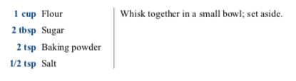

# Recipe Card Generator

Write recipes in Markdown, and generate ready-to-print cards in PDF.

## How It Works

Uses [Pandoc][pandoc] to convert Markdown to HTML, Python 3 to format the recipe, and [Prince XML][prince] to generate a beautiful PDF. Prince XML is a commercial product, but there is a free version for non-commercial use that adds a small watermark on the first page.

[pandoc]: https://pandoc.org
[prince]: https://www.princexml.com

 (Ghostscript is not currently required), for example:


## Set-Up

### Using Docker

By default, Pandoc and Prince XML are run within Docker, but they can also be installed locally, see below.

* Generate the Docker image with `make docker`;
* Create the Python virtual environment with `make venv`.

### Without Docker

If you don’t want to use Docker:

* Install [Pandoc][pandoc];
* Install [Prince XML][prince];
* Ghostscript is not currently required;
* Change the variables in the `Makefile` to the path of the executables (make sure you change them to the actual path where they were installed):

    ```
    # Makefile
    PANDOC = /usr/local/bin/pandoc
    PRINCE = /usr/local/bin/prince
    PYTHON = venv/bin/python
    PIP = venv/bin/pip

    # [...]
    ```

* Create the Python virtual environment with `make venv`.

## Usage

Write a recipe in Markdown in the `recipes` folder. The format is the following:

1. A metadata header in YAML delimited by `---`:

    ```
    ---
    title: Pancakes
    image: pancakes.jpg
    ---
    ```

    The image will be looked for in the `images` folder at the same level as the `recipes` folder.

2. A series of steps, with or without ingredients, separated by `-----`. The ingredients should be given as a bullet list and will appear on the left of the steps that describe what to do with them:

    ```
    * _1 cup_ Flour
    * _2 tbsp_ Sugar
    * _2 tsp_ Baking powder
    * _1/2 tsp_ Salt

    Whisk together in a small bowl; set aside.

    -----
    ```

    Put the quantity for an ingredient in italic, e.g. `* _1 cup_ Flour`, to produce a nicely aligned table:

    

    The quantity is optional:

    ```
    * Assorted toppings

    Serve warm, with desired toppings.
    ```

    

Run the `make` command to generate the cards (in the `cards` folder). To force Make to regenerate a card that it doesn’t think needs regenerating (e.g. if you updated the image), use `make -B cards/pancakes.pdf`, or `make -B` to regenerate all cards.
